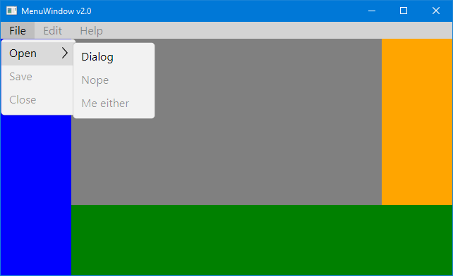

# DockMenu

A menu in a window using the DockPanel layout. You'll use this one a lot. Also, this
sample demonstrates how to open a window as a dialog box, one that must be closed
before the user can continue to interact with its parent window.

