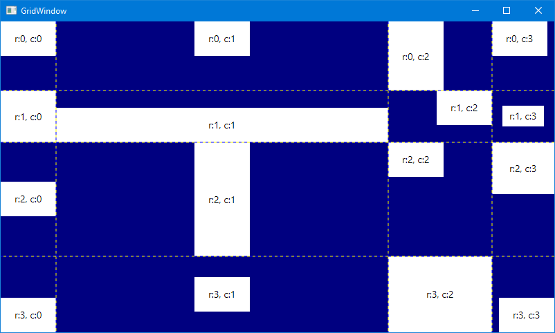

# GridWindow

A 4x4 grid with a label in each cell. You can look at the sizes of each row and column in the
grid, as well as the sizes and alignmnts of each label, to get an idea how they all work
together to decide what the final layout will be. Grids are a versatile way to lay out a
complex UI. In many cases, you may prefer a DockPanel. Note that the children of a control
can be other controls with children. You could even put a grid in one of the children of a
DockPanel. Don't be afraid to experiment.

