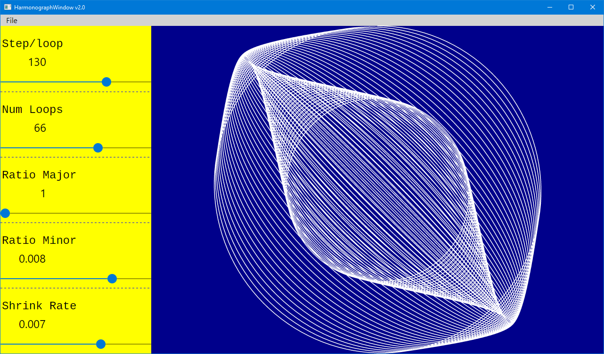

# Harmonograph

This one is offered without a lot of explanation or comments. But start it up and try it first with values
similar to those pictured here. Play with the sliders and see what you get!
