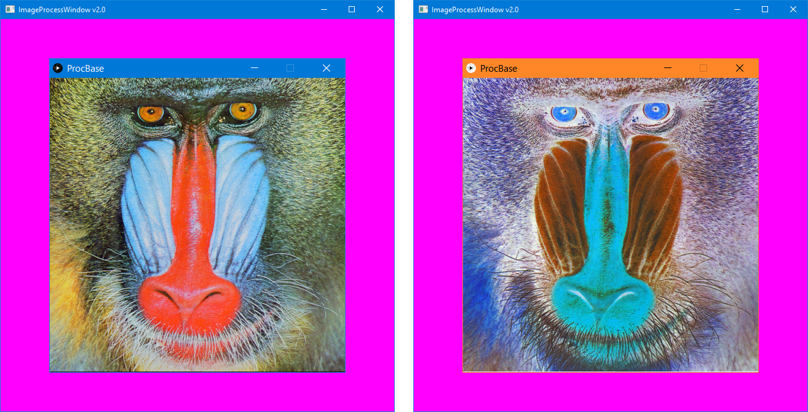

# ImageProcessing

This one loads a bitmap and displays it as an image. When you hold down the mouse button over the image, the colors
are inverted.

I've been doing graphics programming for a long time. If you have too, you probably recognize the gentleman in the picture.

