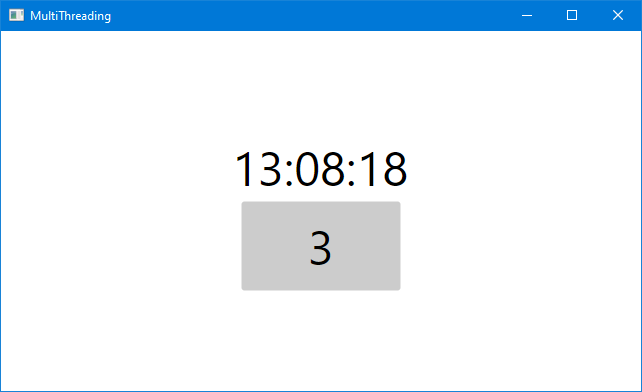

# MultiThreading

If you have a worker thread that wants to update the Avalonia UI, you need to run the
code that makes the actual Avalonia API calls on the "main" UI thread. Doing so
from the worker thread will throw an exception. Avalonia, like pretty much all
modern GUI frameworks, is not thread safe. If it allowed calls to its API from
any thread, it would foul up your screen pretty badly. Fortunately, posting a
lambda to the UI thread's queue of pending jobs is very easy, while your code looks
almost as though you were making direct calls.

This example opens a window with a clock in it, shows the time for ten seconds,
then exits. The time is updated from a worker thread, which also closes the
window. While the clock is being updated, you can also click the button, which
will increment the count of times clicked in its label. This demonstrates that
both a worker thread and user interaction can affect the UI concurrently.

