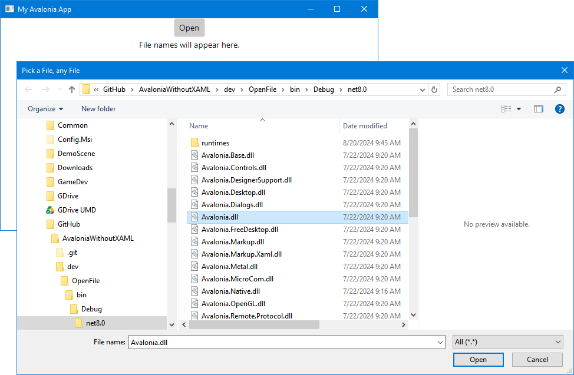

# OpenFile

Use the Avalonia filepicker to get a file name. This example doesn't actually open
the file. It just shows how to get its name. You will see that the method doing the
work is marked "async" and uses the "await" operator. These can be mysterious, but
you can ignore them here if you use them as shown. 

