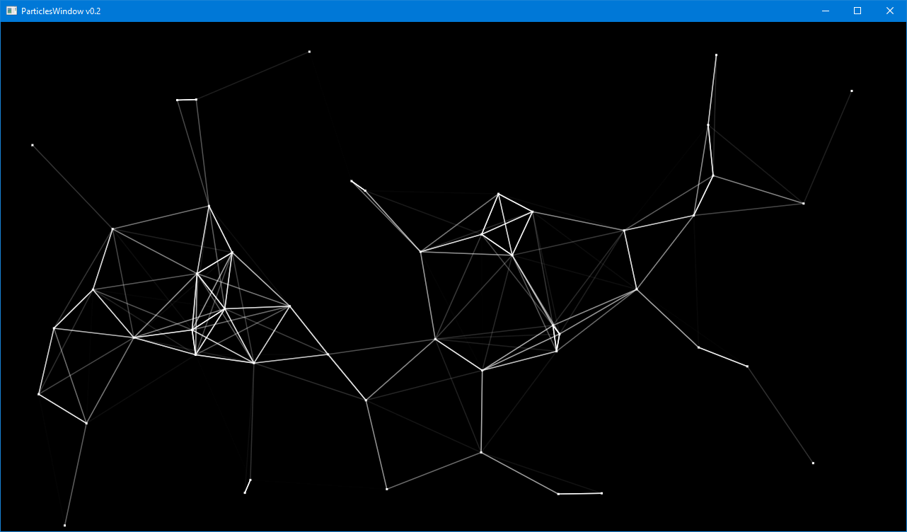

# Particles

Animated particles that come and go at random. Within a certain distance, they have lines drawn
to connect them to each other. The opacity of the lines is a function of the distance.

Note that this example uses a "Metronome" class that you can use for any animation you want
driven by a regular clock. It doesn't (yet) adjust for the time your code consumes between
ticks, however.

This is very much a work in progress, so don't expect the best coding practices yet.

