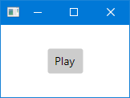

# PlaySound

This is a Windows-only example of how you can play a sound. Note that Avalonia doesn't support
sound. So, I've used the System.Windows.Extensions package. If you want a platform-independent
way to play sounds, you'll have to replace this with something else. Let me know if you find a
good one!

