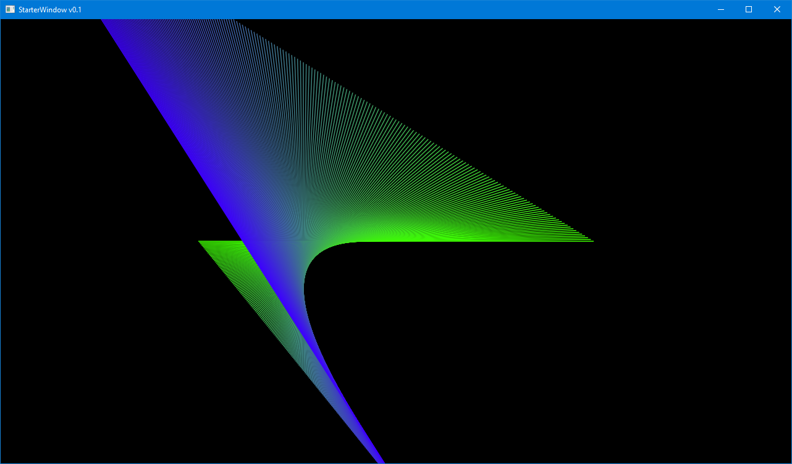

# RepLines

A simple example of the graphic arts idiom known as "Repetition with variation." We
draw a straight line segment many times. Each time, we move the end points just a bit
and we also change the color.

