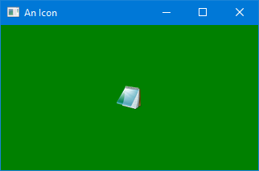

# ShowIcon

This is a Windows-specific example. It gets the icon Windows associates with its Notepad
application, converts it to a Windows GDI+ bitmap, then uses the pixels in that bitmap
to create an Avalonia bitmap. From there, it can use the Avalonia bitmap in an image.

