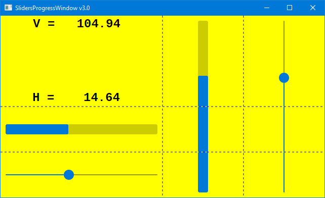

# SlidersProgress

A couple of sliders and progress bars, and labels to show their values.

This sample makes use of the Grid control, but the comments don't explain it much. Have a look a the GridWindow sample for a more detailed
explanation of how grids work.

