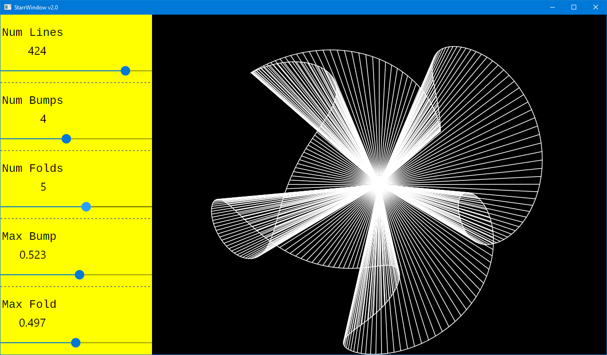

# Starrs

Dr. Norton Starr is professor emeritus of mathematics at Amherst College.
He created some of the first true artwork generated
by computers. His original creations took some time to render, particularly when using an
electromechanical ballpoint pen plotter. Today, we can render them on screen in a fraction of
a second, and print them to paper however fast our printers can print anything else.

Dr. Starr was one of my math teachers at Amherst in the late 1970s. I probably didn't learn
as much math from him as I should have. But I did learn how to make these images. They still
seem as engaging to me now as they did almost 50 years ago.

People familiar with his work sometimes call this shape a "Starr rose." I prefer to call them
"Norton Starrs." This program will let you experiment with how they turn math into pictures.

